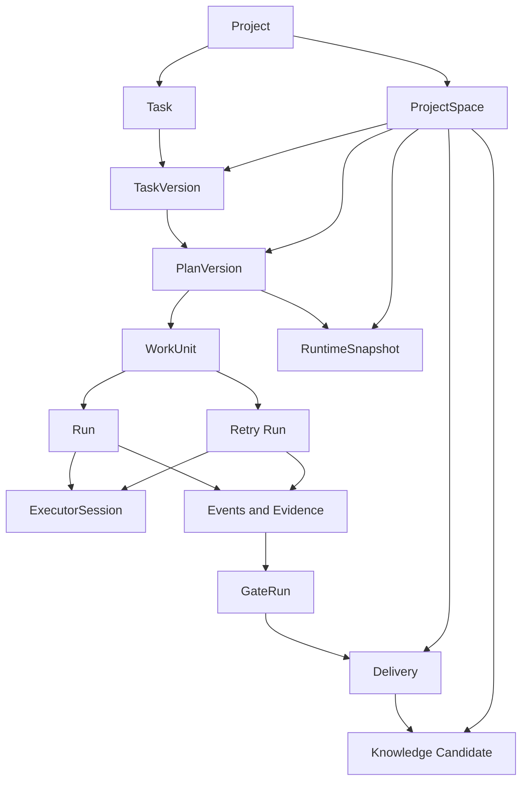
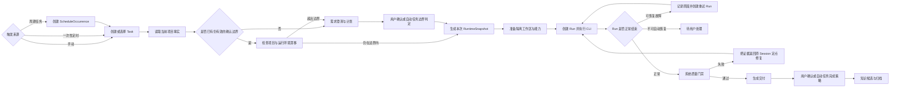

# 研序 Yanxu 1.1–1.5 改进加强版本迭代计划

更新日期：2026-08-08
文档状态：1.1.0–1.5.0 已完成代码实现与 128 项自动测试，等待分版本真实场景和视觉人工验收
产品依据：[Yanxu vNext 产品重构需求文档](./Yanxu-vNext产品重构需求文档.md)  
历史计划：[Yanxu vNext 研发版本计划](./Yanxu-vNext研发版本计划.md)  

## 1. 文档定位

本文定义 Yanxu 1.1.0 至 1.5.0 的改进方向、设计理念、版本边界、主要流程和验收标准。

本文不是详细技术设计，不规定具体数据表、接口、类名或页面组件。后续开发可以根据现有代码选择最小改动方案，但不能改变本文确认的领域含义、产品边界和版本完成条件。

现有 0.2.0–1.0.0 计划继续作为历史设计和实施记录；本文用于约束 1.0.0 候选版之后的工作。两者出现冲突时：

- 已有功能和历史兼容以原 vNext 文档为依据；
- 1.1.0 之后的目标、顺序和完成标准以本文为依据；
- 不因新版本重写历史任务、计划、证据或 ProjectSpace。

## 2. 本轮调整结论

Yanxu 不改变产品定位，不更换技术栈，也不扩张为通用多人协作平台。

本轮改进的目标是：

> 在保留需求澄清、计划确认、多目录交付、确定性质量门禁和可纠正项目记忆的基础上，补强本地 CLI 执行内核，使 OpenCode 与 Claude Code 的每次运行都可观察、可停止、可恢复、可解释，并进一步支持经过确认的项目任务按时间无人值守触发。

本轮参考 Multica 在任务运行、CLI 适配、Daemon 自愈、能力投影和定时触发方面的成熟设计，但只吸收适合 Yanxu 本地单用户形态的部分：

- 借鉴任务与单次运行分离、失败分类、运行记录和恢复语义；
- 借鉴每个 CLI 独立适配、统一输出事件的执行器边界；
- 借鉴 CLI 版本漂移探测、进程组退出和运行时自愈；
- 借鉴 Skill/MCP 按 CLI 原生格式装载，而不是修改全局配置；
- 借鉴“定时只是触发方式”，复用同一任务执行链路；
- 借鉴其克制统一的工作台布局、任务上下文侧栏和独立执行证据查看器；
- 不引入多用户、云端 Workspace、移动端、聊天平台、二十种 CLI 或完全由 AI Leader 驱动的黑盒调度。

## 3. 保持不变的技术与产品边界

### 3.1 技术栈不变

- 前端继续使用 React、TypeScript 和 Ant Design 6。
- 后端与 Daemon 继续使用 Node.js、TypeScript 和 Fastify。
- 本地状态继续使用 SQLite。
- 大体积运行日志继续存储为本地文件，SQLite 保存索引、状态、摘要和证据引用。
- 任务隔离继续使用 Git branch 与 worktree。
- ProjectSpace 继续独立于用户关联目录，并使用本地 Git 保存版本历史。
- 第一阶段只维护 OpenCode 与 Claude Code 两条真实执行主线。

不因为参考其他项目引入 Go、PostgreSQL、账号系统或远程执行集群。

### 3.2 产品边界不变

Yanxu 仍然是本地项目的 AI 研发控制面，而不是：

- 通用 Issue 管理平台；
- 多人组织协作系统；
- 大量 CLI 的统一启动器；
- 复杂可视化工作流引擎；
- 无边界权限的全自动 Agent 平台；
- Skill、角色或 Agent 在线市场。

## 4. 本轮核心理念

### 4.1 程序负责确定性，Agent 负责判断

程序负责状态、进程、工作区、权限、重试、门禁、证据和交付；Agent 负责理解需求、制定方案、修改内容、分析失败和提出建议。

任何模型返回的“成功”都不能覆盖进程异常、Git 无变化、门禁失败或权限越界。

### 4.2 任务目标与单次运行分离

Task 表示用户希望完成的业务目标，Run 表示某个执行器针对一个工作单元进行的一次真实运行。

同一个 Task 可以因为正常推进、恢复、定点修复或重试产生多个 Run。旧 Run 永不被新 Run 覆盖。

本轮不额外引入独立 Attempt 概念：

- 一次可被用户观察、停止并形成结果的执行就是一个 Run；
- 重试创建新 Run，并记录它重试了哪个 Run；
- 同一 CLI Session 可以被多个连续 Run 复用；
- Session 表示上下文连续性，Run 表示一次执行事实，两者不能混为一体。

### 4.3 运行完成不等于任务完成

CLI 正常退出只代表本次 Run 结束。任务仍需经过：

- 工作单元结果检查；
- Git 变更与范围检查；
- 系统质量门禁；
- 必要的独立评审；
- 用户交付确认。

### 4.4 自动化复用主流程

定时任务不建设第二套执行系统。手动、定时和未来外部事件只负责产生触发信号，之后统一进入 Task、计划、RuntimeSnapshot、Run、门禁、交付和知识候选流程。

### 4.5 复用确认过的边界，不复用过期事实

周期任务可以复用用户确认过的目标、目录范围、人员范围、权限上限和验证规则，但不能长期复用旧代码基准、旧目录指纹和旧计划结论。

每次周期触发都必须基于当前项目状态形成新的执行记录和快照。

### 4.6 可观察优先于自动重试

自动重试不能只是“再跑一次”。每次重试必须说明：

- 上一次为什么失败；
- 为什么判断可以自动重试；
- 是否复用工作区和 Session；
- 本次重试的范围；
- 达到什么条件后停止继续消耗。

## 5. 统一概念模型

### 5.1 核心对象

| 对象 | 含义 | 生命周期 |
| --- | --- | --- |
| Project | 用户在 Yanxu 管理的项目 | 长期存在，可关联多个本地目录 |
| ProjectSpace | 需求、计划、快照、证据、交付和知识的本地版本库 | 与 Project 同生命周期，独立于代码目录 |
| Task | 一项需要完成并交付的用户目标 | 从提交到归档、取消或废弃 |
| TaskVersion | 用户纠正或变更后的需求版本 | 只新增，不覆盖旧版本 |
| PlanVersion | 针对某个 TaskVersion 的计划版本 | 回答歧义或重新规划时新增 |
| WorkUnit | 计划中的可执行目标 | 随 PlanVersion 冻结 |
| RuntimeSnapshot | 一次确认后允许使用的项目、人员、能力、权限、分支和验证基线 | 确认后不可被全局配置修改 |
| Run | 某个执行器针对工作单元进行的一次真实运行 | 独立记录启动、事件、结果和失败 |
| ExecutorSession | CLI 的连续对话上下文 | 可跨相关 Run 复用，也可失效或被替换 |
| GateRun | Yanxu 执行的一轮确定性检查 | 记录命令、退出码、超时和日志 |
| ScheduleDefinition | 用户确认的定时触发定义 | 可启用、暂停、修改和删除 |
| ScheduleOccurrence | 某个计划时间点产生的一次触发事实 | 每个时间点唯一，可关联 Task 和 Run |

### 5.2 关系说明

关系约束：

- 一个 Task 可以有多个 TaskVersion，但只有一个当前版本。
- 一个 TaskVersion 可以有多个 PlanVersion，但只有用户确认的版本可生成 RuntimeSnapshot。
- 一个 WorkUnit 可以产生多个 Run，重试通过前序 Run 关联形成链路。
- 一个 ExecutorSession 可以服务同一人员、同一任务中的多个相关 Run。
- 独立评审、切换人员、切换 CLI 或 Session 不可恢复时必须创建新 Session。
- GateRun 由系统执行，不属于模型 Run。

## 6. 统一任务流程

流程中的人工确认原则：

- 普通研发任务默认保留计划确认和最终交付确认。
- 定时只读报告可以通过一次性确认自动重复运行。
- 定时修改任务只有在本次计划未超出已确认自动化边界时才允许自动执行。
- 扩大目录、权限、网络、目标或成功标准时必须重新确认。
- 1.3.0 不允许定时任务自动合并到目标分支。

## 7. 改进加强总清单

### 7.1 执行可靠性与可观测性

- `RUN-001` 明确 Task、WorkUnit、Run 和 ExecutorSession 的关系。
- `RUN-002` 每次执行、恢复和重试形成独立 Run，不覆盖历史。
- `RUN-003` OpenCode、Claude Code 使用统一 ExecutorAdapter 契约。
- `RUN-004` 统一文本、Thinking、工具调用、工具结果、状态、日志和错误事件。
- `RUN-005` 暂停和停止必须覆盖 CLI 及其启动的子进程。
- `RUN-006` CLI 路径或版本变化后自动重新探测并刷新可用状态。
- `RUN-007` Session 恢复必须验证实际连续性，不能只检查数据库中的 Session ID。
- `RUN-008` 区分排队、准备、等待工作区、启动、运行、停止、重试和待用户处理。
- `RUN-009` 失败按基础设施、网络、权限、配置、模型、上下文和业务结果分类。
- `RUN-010` 只有明确可恢复且重复执行风险可控的错误允许自动重试。
- `RUN-011` 准备阶段具备租约、心跳和超时，避免长期停留在模糊状态。
- `RUN-012` 每个 Run 展示时间线、执行器、Session、工具调用、日志、失败原因和下一步。
- `RUN-013` CLI 正常退出、系统验证通过和任务完成必须分别表达。

### 7.2 CLI 能力与运行环境

- `ENV-001` 建立 OpenCode、Claude Code 的实际能力矩阵。
- `ENV-002` Skill 投影到各 CLI 真正识别的原生位置。
- `ENV-003` MCP 使用各 CLI 真实支持的加载方式。
- `ENV-004` 配置明确区分继承本机、任务覆盖和显式清空。
- `ENV-005` 展示本机发现、人员选择、项目启用、任务冻结、运行投影和 CLI 生效链路。
- `ENV-006` 启动前验证必要 Skill、MCP、凭据引用和本地命令。
- `ENV-007` RuntimeSnapshot 冻结 CLI 路径、版本、模型参数、Thinking 和能力版本。
- `ENV-008` 恢复任务时检测 CLI、模型和能力环境漂移。
- `ENV-009` 明确工作区、Session、任务配置和日志的复用边界。
- `ENV-010` 区分必须保留的现场与可以重新生成的依赖、缓存和构建产物。
- `ENV-011` 任务能力切换不能依赖改写用户全局 CLI 配置。

### 7.3 定时任务与统一触发

- `SCH-001` 统一支持手动和定时触发，并为未来外部事件保留同一入口。
- `SCH-002` 支持一次性延时启动已经确认的任务。
- `SCH-003` 支持带时区的周期规则。
- `SCH-004` 自动任务模板保存目标、项目、团队、能力偏好、权限上限和验证策略。
- `SCH-005` 每个计划时间点只产生一个 ScheduleOccurrence。
- `SCH-006` 每次周期触发创建独立 Task、RuntimeSnapshot、Run 和证据链。
- `SCH-007` 支持仅报告、发现后创建任务、边界内自动执行三种模式。
- `SCH-008` 周期任务复用确认边界，不直接复用旧代码基准和旧计划结论。
- `SCH-009` 同一定时任务默认禁止重叠运行，并合并重复触发为一个待执行机会。
- `SCH-010` 支持 macOS 休眠或关机导致的错过执行策略。
- `SCH-011` 定时任务沿用统一失败分类，不对业务失败无限重试。
- `SCH-012` 支持启用、暂停、立即执行、查看历史和删除定义。
- `SCH-013` 1.3.0 中定时任务不能自动合并目标分支或执行高风险外部操作。

### 7.4 差异化研发闭环

- `DIFF-001` 歧义问题提供推荐方案、备选方案和自定义答案。
- `DIFF-002` 计划确认集中展示范围、人员、能力、权限、分支和验收方式。
- `DIFF-003` 一个任务支持多个代码、文档、空目录或非 Git 目录。
- `DIFF-004` 来源目录变化导致计划事实过期时重新规划。
- `DIFF-005` 系统质量门禁只采信真实命令、退出码、信号、超时和日志。
- `DIFF-006` 门禁失败优先返回原 Session 和当前 WorkUnit 定点修复。
- `DIFF-007` 扩大范围或权限必须重新确认。
- `DIFF-008` 交付覆盖多目录变更、目标分支、冲突和合并后门禁。
- `DIFF-009` ProjectSpace 区分项目事实、决策、经验、运行证据和失败记录。
- `DIFF-010` 知识支持候选、确认、修订、失效和 supersedes。
- `DIFF-011` 用户纠正 TaskVersion 后，源自旧版本的知识退出当前检索。
- `DIFF-012` 上下文只使用当前有效知识，并可说明本次采用了哪些项目认知。
- `DIFF-013` 中途接入项目、空项目、文档项目和新建项目使用同一套产品概念。

## 8. 版本路线总览

| 版本 | 主题 | 核心结果 | 主要依赖 |
| --- | --- | --- | --- |
| 1.1.0 | 执行内核与运行诊断 | 每次 CLI 运行可观察、可停止、可恢复、可解释 | 现有 Task、Session、日志和 Scheduler |
| 1.2.0 | 双 CLI 能力与运行环境统一 | OpenCode、Claude Code 的能力真实按任务生效 | 1.1.0 的统一 Run 与 ExecutorAdapter |
| 1.3.0 | 项目定时任务 | 已确认边界内的任务可以按时间无人值守触发 | 1.1.0 的可靠执行与 1.2.0 的能力快照 |
| 1.4.0 | 研发交付与项目记忆收口 | 形成区别于通用 Agent 看板的完整研发闭环 | 前三个版本稳定并通过真实任务验收 |
| 1.5.0 | 信息架构与视觉系统改版 | 将已经验证的功能统一为清晰、克制、可观察的本地研发控制台 | 1.1.0–1.4.0 功能稳定且领域含义不再频繁变化 |

版本必须按顺序验收。允许为后续版本提前预留字段或接口，但不得在当前版本混入后续页面和完整功能。

### 8.1 实现校准（2026-08-08）

为避免“字段存在但运行中不可证实”，最终实现按以下口径收口：

- Run 冻结执行器、模型、人员、尝试次数和工作区，并把增量事件写入独立 JSONL 日志；Run 页面同时关联本次文件变更与后续确定性门禁。
- CLI 校验必须真实启动 OpenCode 或 Claude Code，并由所选模型完成一次最小结构化响应；探测到模型名称不再等同于可运行。
- Skill/MCP 除配置来源和任务投影外，还记录实际运行中的装载、连接、健康、认证或失败状态。
- 定时定义冻结计划摘要、人员/模型、能力、门禁、目录/分支和权限策略；发生边界漂移时回到计划确认，不以“执行失败”掩盖重新确认。
- `coalesce` 只保留一个待执行机会；发现模式先只读检查，无发现形成报告，有发现修订同一任务并等待新计划确认。
- ContextPack 先检索有限候选，再执行相关性排序和数量截断，不读取全部项目知识。
- 上述内容已由类型检查、Lint、自动测试和生产构建覆盖；真实 CLI、真实时间、多仓库交付与视觉仍遵守本文人工验收纪律。

## 9. 1.1.0：执行内核与运行诊断

### 9.1 版本理念

1.1.0 不增加新的业务入口，先把现有任务“到底发生了什么”说清楚。

用户不应再看到无法解释的“恢复任务”“准备完成”或“运行中”。任何持续状态必须同时拥有：

- 当前在等什么；
- 最近一次有效活动；
- 系统准备采取什么动作；
- 是否需要用户处理；
- 对应的 Run、Session 和日志入口。

### 9.2 主要范围

- 收口 Task、WorkUnit、Run 和 ExecutorSession 的关系。
- 重试与恢复创建新 Run，并保留前序关系和现场复用事实。
- OpenCode、Claude Code 使用统一执行器生命周期和事件模型。
- 完善进程组停止、超时、Daemon 重启恢复和 Session 连续性校验。
- CLI 路径或版本变化后自动重新探测，不要求重启 Yanxu。
- 完善准备阶段租约，明确工作区、能力投影和 CLI 启动分别处于什么状态。
- 统一失败分类和自动重试边界。
- 将运行诊断从“日志列表”提升为 Run 时间线与处理建议。
- 在 Task 和 Run 上记录触发来源，为 1.3.0 预留 `MANUAL`、`SCHEDULE` 和未来 `EXTERNAL_EVENT`。

### 9.3 不在本版本完成

- 不开放定时任务创建页面。
- 不新增第三种 CLI。
- 不重做能力中心和项目记忆页面。
- 不加入复杂分布式队列或远程节点。

### 9.4 完成条件

- 两个真实任务并行运行时，Run、工作区、Session 和日志互不覆盖。
- 暂停或停止后不存在由该 Run 遗留的 CLI、MCP 或测试子进程。
- Daemon 重启后，每个未结束 Run 都被恢复、重试或明确转入待处理，不保持假运行状态。
- CLI 路径或版本变化后，Yanxu 能自动刷新可用状态。
- Session 无法恢复时，页面明确显示原因、是否复用工作区以及如何建立新 Session。
- 任意失败都能从 Run 页面定位到分类、日志、系统动作和下一步。
- 至少完成一个真实 OpenCode 长任务和一次人为中断恢复验收。

## 10. 1.2.0：双 CLI 能力与运行环境统一

### 10.1 版本理念

“发现了某个 CLI、Skill 或 MCP”不等于任务中真实可用。1.2.0 要把能力从来源到执行器生效的链路变成可验证事实。

### 10.2 主要范围

- 建立 OpenCode、Claude Code 的能力矩阵，明确模型、Thinking、Session、Skill、MCP 和权限支持差异。
- 对两种 CLI 使用其原生能力发现和任务级投影路径。
- 配置支持继承本机、任务覆盖和显式清空三种语义。
- 页面展示能力来源、项目启用、任务冻结、运行投影和实际生效结果。
- 启动 Run 前验证必要能力、凭据引用、命令和兼容性。
- RuntimeSnapshot 冻结实际 CLI、模型和能力版本。
- 恢复时检测运行环境漂移，并根据是否影响任务决定继续、重新准备或待用户处理。
- 明确什么时候复用工作区和 Session，什么时候必须创建隔离环境。
- 增加现场、日志、依赖和缓存的保留及清理策略。

### 10.3 不在本版本完成

- 不新增在线能力市场。
- 不自动安装第三方脚本或依赖。
- 不因为兼容问题修改用户的全局 CLI 配置。
- 不接入 Codex 或其他 CLI。

### 10.4 完成条件

- 同一个标准 Skill 能分别被真实 OpenCode 和 Claude Code 任务使用。
- 至少一个本地 MCP 能分别显示解析、命令、连接和任务装载结果。
- 页面能够解释“发现但未启用”“启用但未装载”“装载但运行失败”的区别。
- 两个并行任务使用不同 Skill/MCP 配置时互不污染。
- 任务运行不会永久修改用户的 OpenCode 或 Claude Code 全局配置。
- CLI、模型或能力版本漂移后，恢复任务能给出明确决定和证据。
- OpenCode、Claude Code 各完成一个真实需求闭环后，本版本才算通过。

## 11. 1.3.0：项目定时任务

### 11.1 版本理念

定时任务是任务的触发器，不是新的 Agent、角色、工作流或交付体系。

用户确认的是可以长期复用的自动化边界；每次触发仍然依据当前项目事实创建独立任务和运行记录。

### 11.2 支持的任务模式

#### 仅报告

自动读取、检查和生成报告，不修改用户项目。适合测试巡检、依赖检查、日志分析和项目状态报告。

#### 发现后创建任务

定时抓取或检查，发现问题后创建待确认任务，不直接修改项目。适合 GitHub Issue、需求文件、依赖更新和外部数据源。

#### 边界内自动执行

允许在用户确认过的目录、权限和验证规则内修改并测试。超出边界时停止并等待重新确认。首期执行完成后进入待交付，不自动合并目标分支。

### 11.3 一次性与周期任务

- 一次性延时：为一个已经确认的 Task 设置未来启动时间；到期时重新检查 RuntimeSnapshot 是否仍然有效。
- 周期任务：保存 ScheduleDefinition；每个计划时间点创建 ScheduleOccurrence，并基于当前项目状态创建新的 Task 和 Run。

修改 ScheduleDefinition 只影响后续 Occurrence，不能改写已经产生的历史任务。

### 11.4 并发与错过执行

- 同一个 ScheduleDefinition 默认不允许两个 Occurrence 同时运行。
- 上一次尚未完成时，新触发默认合并为一个待执行机会，避免按次数堆积相同任务。
- 用户可以选择跳过本次，但首期不提供无限排队和并行策略。
- macOS 休眠或关机导致错过执行时，默认在 Yanxu 恢复后补跑一次，而不是补跑每一个错过时间点。
- 所有触发使用计划时间与 ScheduleDefinition 组成幂等标识，避免 Daemon 重启后重复创建。

### 11.5 自动确认边界

周期任务每次执行前都要比较当前计划与已确认自动化边界：

- 目录、权限、网络、能力和验证方式仍在边界内，可以自动继续；
- 代码基准变化但目标和范围未扩大，重新生成当前快照后继续；
- 需要新增目录、提升权限、改变目标或降低门禁，转为待用户确认；
- 运行所需 CLI、模型或凭据不可用，进入待处理，不静默换用其他人员或模型。

### 11.6 完成条件

- 一个已确认任务能够在指定时间自动启动。
- 一个只读检查能够周期运行，并为每次运行生成独立报告和证据。
- 一个定时抓取任务能够发现内容并创建待确认任务。
- 一个边界内自动执行任务能完成修改、门禁并进入待交付。
- macOS 休眠后可以按配置补跑一次或跳过。
- 上一次仍在运行时不会创建重叠执行。
- Daemon 重启不会为同一计划时间重复创建 Occurrence。
- 定时任务不会自动合并、推送远程仓库或执行部署。

## 12. 1.4.0：研发交付与项目记忆收口

### 12.1 版本理念

1.4.0 不继续横向增加功能，而是证明 Yanxu 的差异化能力在真实项目中成立：

> 用户确认目标和边界后，Agent 可以无人值守执行；系统以真实证据验证结果；用户纠正后，项目认知能够随之纠正。

### 12.2 主要范围

- 收口需求澄清、推荐方案、计划确认和变更重新确认。
- 完善多目录、多仓库、非 Git、空项目和文档项目的统一任务体验。
- 对来源目录漂移、基准分支变化和计划过期提供明确处理。
- 强化门禁失败返回原 Session 的定点修复闭环。
- 完善多目录交付、目标分支、冲突、反向补偿和合并后门禁。
- 区分项目事实、决策、经验、运行证据和失败记录。
- 完善知识候选、确认、修订、失效、supersedes 和 TaskVersion 纠正联动。
- 在 ContextPack 中记录本次选用了哪些有效知识以及为什么相关。
- 定时任务结果只形成报告或知识候选，不直接进入当前有效记忆。

### 12.3 完成条件

- 一个真实前后端多仓库需求完成计划、执行、门禁和交付。
- 制造一次真实门禁失败，并由原 Session 定点修复，不从任务开头重跑。
- 执行中扩大目录或权限时能够回到计划确认。
- 一个存在本地未提交改动的项目能够冻结基线并安全隔离任务。
- 一个正常冲突可以确定性处理，一个语义冲突能够保留现场等待用户。
- 用户纠正需求后，旧 TaskVersion 派生知识退出当前检索。
- 新建空项目、已有项目和文档项目分别完成一次真实任务。
- 一个定时任务结果能够形成报告或待确认知识候选，且不会污染长期记忆。

## 13. 1.5.0：信息架构与视觉系统改版

### 13.1 版本理念

1.5.0 是最后进行的整体界面改版，不是单纯换颜色、调间距或堆叠更多卡片。

本版本建立在 1.1.0–1.4.0 已经跑通并完成真实验收的功能之上，用统一的信息架构和视觉语言解决以下问题：

- 用户进入任何页面后，都能快速判断自己处于哪个项目、哪个任务和哪个运行阶段；
- 任务正在做什么、为什么等待、为什么失败、下一步是什么，不再依赖用户翻接口或原始日志；
- 需求、计划、执行、测试、评审、交付和知识仍是明确产物，不被活动流或对话替代；
- 角色、技能、CLI、MCP、模型和运行环境使用适合高密度信息的列表或矩阵，不再形成散乱卡片墙；
- 所有页面共享同一套间距、字号、表面、状态色、空状态和反馈方式。

本版本参考 Multica 的工作台结构和视觉系统，但只借鉴适合 Yanxu 本地单用户研发控制台的部分。不得将 Yanxu 改造成多用户 Issue 管理或评论协作产品。

### 13.2 借鉴原则

#### 直接借鉴

- 左侧全局导航、中央工作面、右侧上下文的稳定三层结构。
- 浅灰应用外壳、接近白色的页面画布、白色有限表面和轻量浮层的层级关系。
- 细边框、轻阴影、紧凑控件、受控正文宽度和有限字号阶梯。
- 状态语义贯穿任务列表、任务详情、运行证据、测试评审和交付页面。
- 独立运行证据查看器，以事件、时间、类型、耗时和结果组织执行过程。
- 能力与运行环境采用高密度列表或矩阵，而不是大面积卡片。

#### 改造后借鉴

- Multica 的事项看板改造成 Yanxu 的任务进度看板：一个需求保持一条可连续阅读的任务条，突出当前阶段、已完成阶段和后续阶段；项目内可以提供辅助看板，但不能取代阶段进度。
- Multica 的评论中心详情改造成 Yanxu 的版本化产物中心：需求、计划、变更、测试、评审和交付分别展示，活动流只提供证据和时间线。
- Multica 的 Agent 成员概念改造成 Yanxu 的“角色 × 技能 × CLI/模型”人员抽象，并区分人员定义与本次执行实例。
- Multica 的项目资源改造成 ProjectSpace、用户关联目录/仓库和任务隔离工作区三种明确对象。

#### 不照搬

- 不引入多用户 Workspace、成员收件箱和社交协作入口。
- 不把固定六列 Kanban 作为唯一首页。
- 不把任务结果、计划修改和需求纠正全部塞进评论流。
- 不为了模仿桌面软件而引入没有明确价值的顶部多标签外壳。
- 不用大面积渐变、过多状态颜色或复杂动画掩盖信息层级问题。

### 13.3 目标信息架构

#### 全局层

- 项目；
- 调度台；
- 定时任务；
- 角色与技能；
- 运行环境；
- 设置。

#### 项目层

- 任务；
- 项目知识；
- 关联资源；
- 项目历史。

#### 任务层

- 需求与计划；
- 阶段进度；
- 当前执行；
- 测试与评审；
- 交付与归档。

#### 诊断层

- 独立 Run 证据查看器；
- 支持查看事件概览、工具调用、日志、失败分类、重试关系、Session、工作区、门禁和下一步建议；
- 从任务详情和运行状态入口随时进入，但不挤占任务正文的主要阅读空间。

### 13.4 主要范围

- `UI-001` 建立统一设计变量，覆盖应用外壳、页面画布、表面、浮层、字号、间距、圆角、边框、阴影和语义状态色。
- `UI-002` 重构全局页面框架，统一左侧导航、页面头部、中央工作面和可选右侧上下文栏。
- `UI-003` 重构全局调度台，以长任务条和阶段进度清楚表达并行任务、当前阶段、等待原因和后续步骤。
- `UI-004` 重构项目详情，清楚区分项目任务、ProjectSpace 知识、关联资源和项目历史。
- `UI-005` 重构任务详情，以版本化产物为中心，固定展示任务状态、当前执行、团队、目录/仓库、基准分支和关键操作。
- `UI-006` 建立独立 Run 证据查看器，支持事件类型、排序、筛选、复制、耗时、失败定位和重试链路。
- `UI-007` 统一需求规格、计划、测试、评审和交付的 Markdown 阅读与编辑样式。
- `UI-008` 重构角色、技能、CLI、MCP 和能力中心，使用列表、矩阵和详情侧栏表达来源、绑定、生效范围和健康状态。
- `UI-009` 重构定时任务创建与详情，将任务说明和触发配置分区，并展示下一次运行与历史结果。
- `UI-010` 统一加载、空状态、无权限、待确认、阻塞、失败、停止、重试和完成反馈。
- `UI-011` 完成桌面窗口缩放、键盘焦点、文字对比度、操作目标尺寸和信息非纯颜色表达检查。
- `UI-012` 建立关键页面截图基线，避免后续局部修改重新造成样式漂移。

### 13.5 视觉参考资产

参考截图临时保存在 [`docs/assets/multica-ui-reference`](./assets/multica-ui-reference/)；这些图片只用于理解布局、信息密度和交互层级，不作为逐像素复制目标。

| 研序改版页面 | 参考重点 | 截图 |
| --- | --- | --- |
| 项目与任务看板 | 中央看板、浅状态背景、右侧项目属性 | [项目看板](./assets/multica-ui-reference/03-project-detail.png) |
| 需求输入与任务草稿 | 文档式大输入区、低频属性收口 | [创建任务](./assets/multica-ui-reference/04-new-issue-agent.png) |
| 执行中的任务详情 | 主内容、运行状态、属性与执行入口分层 | [执行中的任务](./assets/multica-ui-reference/05-agent-working.png) |
| Run 证据查看器 | 事件概览、筛选、排序、时间和类型 | [执行证据](./assets/multica-ui-reference/06-task-transcript.png) |
| 交付与 Markdown | 正文宽度、文档层级、运行历史侧栏 | [交付结果](./assets/multica-ui-reference/07-run-result.png) |
| 角色与技能 | 高密度列表、归属关系、更新时间 | [技能列表](./assets/multica-ui-reference/08-skills-list.png) |
| CLI 与运行环境 | 机器状态、CLI 健康度、绑定和版本 | [运行环境](./assets/multica-ui-reference/09-runtime-detail.png) |
| 定时任务 | 任务说明与触发配置分区、下次运行预览 | [定时任务](./assets/multica-ui-reference/10-autopilot-schedule.png) |

### 13.6 不在本版本完成

- 不改变 1.1.0–1.4.0 已确认的任务、运行、门禁、交付和知识领域含义。
- 不以样式改版为理由重写执行内核、增加第三种 CLI 或新增远程执行。
- 不新增登录、多用户、移动端和消息平台入口。
- 不制作复杂工作流画布、可拖拽 DAG 或自由布局仪表盘。
- 不追求与 Multica 逐像素一致，也不复制其品牌、文案和多用户功能。

### 13.7 完成条件

- 全局调度台、项目详情、任务详情、Run 证据、交付、角色与技能、运行环境、定时任务和设置使用同一页面框架与设计变量。
- 用户在调度台无需进入任务详情即可判断每个任务已完成、正在执行和后续阶段。
- 用户进入任务详情后能在一个页面内找到当前需求版本、确认计划、执行状态、测试评审、交付结果和运行证据入口。
- 任意等待、阻塞、失败或重试状态都能显示原因、最近活动、系统动作和下一步。
- Markdown 在需求、计划、测试、评审和交付页面中正确展示标题、列表、表格、代码块、链接和长文本。
- 角色、技能、CLI、MCP 和模型的发现、启用、挂载、任务冻结和实际生效关系可被清楚辨认。
- 在 macOS 常见桌面窗口宽度下不存在主要内容遮挡、关键操作不可达或必须依赖浏览器开发者工具才能查看的信息。
- 完成文字对比度、键盘焦点、状态非纯颜色表达和主要操作目标尺寸检查。
- 建立关键页面视觉基线并完成逐页人工验收。
- 改版不破坏 1.1.0–1.4.0 已通过的真实 OpenCode、Claude Code、定时任务、多目录交付和项目记忆验收。

## 14. 跨版本验收纪律

为避免长时间连续开发造成范围漂移或“代码存在即功能完成”，每个版本统一使用以下状态：

| 状态 | 含义 |
| --- | --- |
| 未开始 | 尚未进入当前版本实施 |
| 实现中 | 正在修改代码，不能对外宣称完成 |
| 自动检查通过 | 类型、测试、构建通过，但尚未完成真实 CLI 验收 |
| 待人工验收 | 功能已具备，等待用户按版本场景验证 |
| 已验收 | 自动检查和真实场景均通过，用户确认结果 |

版本推进遵守以下规则：

1. 每次只实施当前版本，不同时开发后续版本的完整功能。
2. 开始版本前，根据本文生成该版本的有限开发清单。
3. 每完成一项，记录对应需求编号、修改范围和验证证据。
4. 自动测试不能替代真实 OpenCode、Claude Code 或定时运行验证。
5. 页面出现、接口返回或模型自报成功不能作为功能完成证明。
6. 版本结束时重新逐条对照本文，列出已实现、部分实现、假实现和未实现。
7. 未通过当前版本真实验收前，不自动开始下一版本；如需继续，由用户明确决定。
8. 发现原设计不合理时先更新本文或形成决策记录，再修改实现，不能让代码悄悄改变产品定义。

## 15. 全版本共同非目标

- 不接入 Codex 或更多 CLI。
- 不做登录、多用户、云端同步和远程执行节点。
- 不做移动端、Slack、飞书、钉钉或其他消息入口。
- 不做通用 Issue、工单或项目管理平台。
- 不做复杂 DAG、工作流画布或同一任务大规模并行 Agent 图。
- 不做模型自动竞价、成本路由或效果排行榜。
- 不做 Skill、Role、MCP 在线市场和社区评分。
- 不默认绕过全部操作系统权限。
- 不允许定时任务自动推送、部署或合并目标分支。
- 不因为本轮改进更换现有技术栈。

## 16. 最终完成定义

1.5.0 完成不能只看功能数量。必须同时满足：

- 用户能从 Run 详情理解任何任务为何运行、等待、重试、失败或停止；
- OpenCode 与 Claude Code 的能力、Session、日志和错误使用统一产品语义；
- CLI 或 Daemon 变化不会制造长期假运行状态；
- 已确认任务可以按时间无人值守触发，并在越界时停下来；
- 多目录研发任务通过真实系统门禁后才能交付；
- 模型成功说明不能覆盖客观失败；
- 用户纠正能够影响后续计划和当前有效项目知识；
- ProjectSpace、历史任务和现有本地目录在升级过程中保持可读、可恢复和可追溯；
- 全局调度台、项目、任务、Run、能力和定时任务形成统一且可理解的本地研发控制台；
- 用户不需要读取原始接口或数据库即可判断任务当前状态、运行证据和下一步；
- 所有版本均完成自动检查和对应的真实人工验收。
